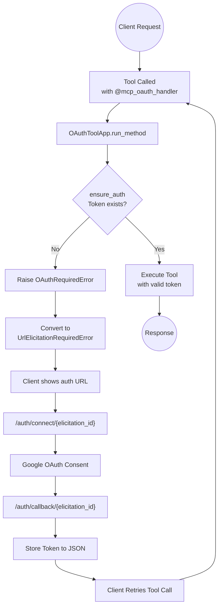

# Assistant-MCP

An MCP (Model Context Protocol) server template that provides OAuth 2.0-protected tools to agentic clients. Built with FastMCP and currently integrates with Google APIs.

## Architecture



### Components

| Component | Location | Purpose |
|-----------|----------|---------|
| FastMCP Server | `src/main.py` | Entry point, tool definitions, OAuth routes |
| OAuth Gate | `src/auth/oauth_gate.py` | Token validation and OAuth flow initiation |
| OAuthToolApp | `src/mcp_tools/auth_tool_app.py` | Base class for OAuth-protected tools |
| Google Provider | `src/auth/providers/google_provider.py` | Google OAuth 2.0 implementation |
| Calendar Tools | `src/mcp_tools/google/calendar.py` | Google Calendar API wrapper |
| Decorators | `src/utils/decorators.py` | Scopes, retry, OAuth error handling |

### OAuth Flow Steps

| Step | Description |
|------|-------------|
| 1 | Client calls MCP tool (e.g., `list_calendars`) |
| 2 | `@mcp_oauth_handler` decorator wraps tool function |
| 3 | `OAuthToolApp.run_method` passes to `ensure_auth` |
| 4 | `ensure_auth` checks for valid token via provider |
| 5 | If no token, raises `OAuthRequiredError` with `elicitation_id` |
| 6 | Decorator converts to `UrlElicitationRequiredError` with auth URL |
| 7 | Client redirects user to `/auth/connect/{elicitation_id}` |
| 8 | Server redirects to Google OAuth consent screen |
| 9 | After consent, Google redirects to `/auth/callback/{elicitation_id}` |
| 10 | Server exchanges code for token and stores it |
| 11 | Client retries original tool call with valid token |

## Project Structure

```
assistant-mcp/
├── .env                       # Environment configuration
├── .gitignore
├── .python-version            # Python 3.13
├── pyproject.toml             # Dependencies and metadata
├── uv.lock                    # Dependency lock file
├── CLAUDE.md                  # Project documentation
├── README.md
│
└── src/
    ├── main.py                # FastMCP server entry point, tool definitions
    │
    ├── auth/
    │   ├── oauth_gate.py      # OAuth flow management, token elicitation
    │   ├── providers/
    │   │   ├── provider.py        # Abstract OAuthProvider interface
    │   │   ├── google_provider.py # Google OAuth implementation
    │   │   └── provider_registry.py # Provider lookup by name
    │   └── tokens/
    │       ├── auth_token.py      # Abstract token interface
    │       └── google_token.py    # Google token implementation
    │
    ├── mcp_tools/
    │   ├── auth_tool_app.py   # Base class for OAuth-protected tools
    │   └── google/
    │       └── calendar.py    # Google Calendar tool implementations
    │
    ├── utils/
    │   ├── decorators.py      # @tool_scope_factory, @tool_retry_factory, @mcp_oauth_handler
    │   └── errors.py          # Custom exceptions (OAuthRequiredError, etc.)
    │
    └── db/
        └── db.py              # Database utilities
```

## Installation

```bash
# Clone the repository
git clone <repo-url>
cd assistant-mcp

# Install dependencies with uv
uv sync
```

Or with pip:

```bash
pip install -e .
```

## Configuration

Create a `.env` file with:

```env
GOOGLE_SECRETS_PATH=./secrets/client_secret.json
GOOGLE_LOCAL_TOKEN_PATH=./secrets/token.json
SERVER_HOST=127.0.0.1
SERVER_PORT=8000
```

| Variable | Description |
|----------|-------------|
| `GOOGLE_SECRETS_PATH` | Path to Google OAuth client secrets JSON file |
| `GOOGLE_LOCAL_TOKEN_PATH` | Path where OAuth tokens will be stored |
| `SERVER_HOST` | Server host address (default: 127.0.0.1) |
| `SERVER_PORT` | Server port number (default: 8000) |

### Google OAuth Setup

1. Go to [Google Cloud Console](https://console.cloud.google.com/)
2. Create a new project or select existing
3. Enable the Google Calendar API
4. Go to **Credentials** → **Create Credentials** → **OAuth client ID**
5. Select **Web application**
6. Add authorized redirect URI: `http://127.0.0.1:8000/auth/callback/{elicitation_id}`
   - Note: For development, use a wildcard pattern or add specific IDs as needed
7. Download the JSON file and save to `GOOGLE_SECRETS_PATH`

## Running

```bash
cd assistant-mcp
python src/main.py
```

Or with uv:

```bash
uv run python src/main.py
```

The server runs at `http://{SERVER_HOST}:{SERVER_PORT}/mcp` using streamable HTTP transport.

## MCP Tools

### Calendar Tools

| Tool | Parameters | Output | OAuth Required |
|------|------------|--------|----------------|
| `list_calendars` | (none) | `calendar_id`, `name`, `description` | Yes |
| `list_events` | `calendar_id`, `start_time`, `duration_days` | `event_id`, `name`, `start`, `end` | Yes |
| `create_event` | `calendar_id`, `start`, `name`, `duration_minutes`, `location`, `description` | `event_id`, `event_details` | Yes |
| `update_event` | `calendar_id`, `event_id`, `start`, `name`, `duration_minutes`, `location`, `description` | `event_id`, `event_details` | Yes |

### Tool Prerequisites

| Tool | Prerequisite |
|------|--------------|
| `list_calendars` | None |
| `list_events` | `calendar_id` from `list_calendars` |
| `create_event` | `calendar_id` from `list_calendars` |
| `update_event` | `calendar_id` from `list_calendars`, `event_id` from `list_events` |

### Default Values

- `calendar_id`: `'primary'` (uses primary calendar if not specified)
- `duration_minutes`: `30` (for create/update)
- `duration_days`: `7` (for list_events)

## OAuth Flow

When a tool requires authentication and no valid token exists:

```
1. Client calls tool (e.g., list_calendars)
   ↓
2. OAuthToolApp.run_method invokes ensure_auth
   ↓
3. ensure_auth checks provider for valid token
   ↓
4. No token found → OAuthRequiredError with elicitation_id
   ↓
5. @mcp_oauth_handler converts to UrlElicitationRequiredError
   ↓
6. MCP client receives auth URL, displays to user
   ↓
7. User visits /auth/connect/{elicitation_id}
   ↓
8. Server redirects to Google OAuth consent
   ↓
9. User authorizes, Google redirects to /auth/callback/{elicitation_id}
   ↓
10. Server exchanges code for token, stores in JSON file
    ↓
11. User sees "You may close this tab"
    ↓
12. Client retries tool call → succeeds with valid token
```

## API Routes

### GET /auth/connect/{elicitation_id}

Initiates OAuth flow by redirecting to Google OAuth consent screen.

**Request:**
```bash
curl -L http://127.0.0.1:8000/auth/connect/{elicitation_id}
```

**Response:** 302 redirect to Google OAuth consent URL

### GET /auth/callback/{elicitation_id}

OAuth callback handler. Receives authorization code and exchanges for token.

**Request:** (from Google redirect)
```
http://127.0.0.1:8000/auth/callback/{elicitation_id}?code=...&state=...
```

**Response:**
```
You may close this tab.
```

## Key Design Patterns

### Factory Pattern (Decorators)

Decorators create specialized behavior for tool methods:

```python
@tool_scope_factory(scopes=["https://www.googleapis.com/auth/calendar"])
@tool_retry_factory(error_message="Google Calendar error", retry_on=(HttpError,))
def list_calendars(self, *, token: GoogleToken, ctx: Dict[str, Any]):
    ...
```

### Strategy Pattern (OAuthProvider Interface)

Abstract provider interface allows multiple OAuth implementations:

```python
class OAuthProvider(ABC):
    @abstractmethod
    def get_access_token(self, principal_id: str, scopes: Sequence[str]) -> Optional[OAuthToken]:
        ...

    @abstractmethod
    def generate_auth_url(self, scopes: Sequence[str], elicitation_id: str, ...) -> dict:
        ...
```

### Decorator Composition

Tool functions compose multiple decorators:

```python
@mcp.tool()
@mcp_oauth_handler("Authorization is required to access your Google Calendar.")
def list_calendars(ctx: Context):
    return calendar_tools.run_method('list_calendars', ctx=ctx)
```

- `@mcp.tool()`: Registers function as MCP tool
- `@mcp_oauth_handler`: Handles OAuth errors, converts to URL elicitation

### Separation of Concerns

- **main.py**: Tool definitions and MCP routing only
- **auth/**: All OAuth logic (providers, tokens, flow management)
- **mcp_tools/**: Tool implementations with business logic
- **utils/**: Shared utilities (decorators, errors)

## Tool Implementation

To add a new OAuth-protected tool:

```python
# In src/main.py
@mcp.tool()
@mcp_oauth_handler("Authorization message")
def my_tool(ctx: Context, param: str):
    """Docstring becomes tool description"""
    return tool_app.run_method('method_name', ctx=ctx, param=param)
```

```python
# In tool app class
@tool_scope_factory(scopes=[...])
@tool_retry_factory(error_message=..., retry_on=(...))
def method_name(self, *, token: GoogleToken, ctx: Dict, param: str):
    # Implementation using token.present_creds()
    ...
```

## Related

- **msg-agent**: Companion MCP client project that consumes these tools using LangGraph
